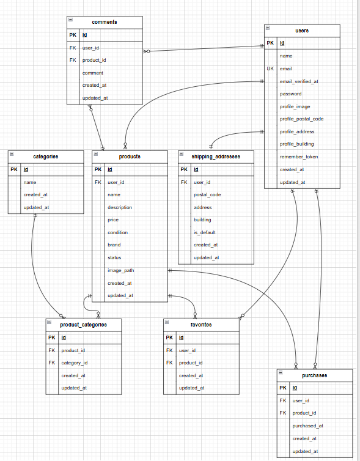

# **フリマアプリ**

## **概要**
フリマアプリケーションです。Laravel Framework 8.83.8 + PHP 7.4.9 + MySQL 8.0.26 + Docker環境で構築されています。

## **機能一覧**
- 会員登録・ログイン・ログアウト（Laravel Fortify）
- 商品一覧表示・詳細表示・検索機能
- マイリスト機能（お気に入り）
- いいね機能・コメント機能（Ajax対応）
- 商品購入機能・支払方法選択・配送先変更
- プロフィール表示・編集機能
- 商品出品機能
- レスポンシブデザイン対応

## **環境構築**
### 前提条件
以下がインストールされている必要があります。
- Docker
- Docker Compose
- Git

### セットアップ手順
1. リポジトリをクローン
```bash
git clone git@github.com:hosako-mikako/flea-market-test.git
cd flea-market-test
```

2. Docker環境を起動
```bash
docker-compose up -d --build
```

3. PHPコンテナに入る
```bash
docker-compose exec php bash
```

4. laravelプロジェクトディレクトリに移動
```bash
cd /var/www
```

5. Composerで依存関係をインストール
```bash
composer install
```

6. アプリケーションキーを生成
```bash
php artisan key:generate
```

7. データベースマイグレーション実行
```bash
php artisan migrate
```

8. シーダー実行
```bash
php artisan db:seed
```


## **使用技術（実行環境）**
- PHP: 7.4.9
- Laravel: 8.83.8
- MySQL: 8.0.26
- Docker: Docker Compose使用
- 認証: Laravel Fortify
- フロントエンド: Blade, CSS, JavaScript（Ajax）

## **URL**
### 開発環境
- お問い合わせ画面: http://localhost
- ユーザー登録: http://localhost/register
- phpMyAdmin: http://localhost:8080

## **データベース設定**
### 接続情報
- ホスト: mysql
- ポート: 3306
- データベース名: laravel_db
- ユーザー名: laravel_user
- パスワード: laravel_pass

## **初期データ**
シーダー実行により以下が作成されます。
- ユーザー: 2名
- 商品: 10件
- カテゴリー: 16種類
- 配送先住所: 複数件 
- お気に入り・購入履歴: テスト用データ

## **初期データ（テスト用）**
シーダー実行後、以下のユーザーでログインできます。
テストユーザーは商品出品済みのため、新規ユーザー登録で全商品確認可能です。

ユーザー1: 田中太郎
- メールアドレス: tanaka@example.com
- パスワード: password123
- 表示される商品: 5件（佐藤花子の出品商品）

ユーザー2: 佐藤花子
- メールアドレス: sato@example.com
- パスワード: password123
- 表示される商品: 5件（田中太郎の出品商品）

注意
- これらは開発・テスト用のアカウントです。
- 商品一覧では自分が出品した商品は表示されません。
- 全商品を確認する場合は、新規ユーザー登録を行ってください。


## **ER図**




